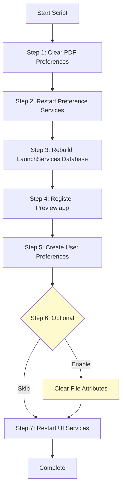

# Force Preview PDF Default - MDM Deployment Script

A focused macOS script for MDM deployment that sets Apple Preview as the default PDF handler without affecting Adobe applications or other file type associations.

## Overview

This script addresses the common enterprise issue where Adobe Acrobat/Reader takes over as the default PDF handler. The script uses a targeted approach to set Preview as the default while preserving all Adobe functionality and other file associations.

**Important**: This script does NOT uninstall Adobe products or prevent them from functioning. It only changes the default PDF viewer.

## Features

- **Targeted PDF-Only Changes**: Only modifies PDF file associations, preserving all other defaults
- **Preserves Adobe Functionality**: Adobe Creative Cloud and all Adobe apps continue to work normally
- **Multi-User Support**: Applies changes for all user accounts on the system
- **MDM-Ready**: Designed to run as root via MDM platforms
- **Detailed Logging**: Timestamped logs with clear status indicators
- **Minimal Impact**: Surgical approach that doesn't disrupt workflows

## Configuration Profile (mobileconfig)

The included `force_preview_pdf_default_mdm.mobileconfig` file provides an alternative or complementary approach to setting Preview as the default PDF handler through macOS configuration profiles.

### What is the mobileconfig?

The mobileconfig is an Apple Configuration Profile that uses managed preferences to define system-wide PDF file associations. Unlike the script which makes changes after the fact, the configuration profile establishes these preferences at the system level.

### Key Components

1. **LaunchServices Handlers**: The profile defines multiple handlers to catch all PDF file types:
   - `com.adobe.pdf` - Adobe's PDF content type
   - `public.pdf` - Apple's standard PDF UTI
   - `pdf` file extension - Catches files by extension

2. **Profile Metadata**:
   - PayloadIdentifier: `com.organization.pdf-preview-default`
   - PayloadScope: `System` - Applies to all users
   - PayloadType: `com.apple.ManagedClient.preferences`

### When to Use the mobileconfig vs Script

**Use the mobileconfig when:**
- You want a preventative approach that blocks Adobe from taking over
- You need a persistent setting that users cannot easily change
- You're deploying to new machines or doing initial setup
- You want a cleaner, system-level solution

**Use the script when:**
- Adobe has already taken over as the default
- You need to clean up existing preferences
- You want immediate results on already-configured machines
- You need more granular control over the process

**Best Practice**: Deploy both! Use the mobileconfig for ongoing enforcement and the script for initial cleanup.

### Deploying the mobileconfig

Configuration profiles can be deployed through your MDM solution. Consult your MDM documentation for specific instructions on deploying custom configuration profiles.

### Deploying the Script

Scripts can be deployed through your MDM solution. Consult your MDM documentation for specific instructions on deploying and executing custom scripts.

### Customizing the mobileconfig

To customize for your organization:
1. Replace `Your Organization` with your company name
2. Update the PayloadIdentifier to use your reverse domain (e.g., `com.yourcompany.pdf-preview-default`)
3. Generate new UUIDs for PayloadUUID values if creating multiple versions

### Technical Details

The profile works by registering Preview.app (`com.apple.Preview`) as the handler for all PDF-related content types and extensions through managed preferences.

### Troubleshooting the mobileconfig

#### System Preferences/Settings Shows Only "General" and "Spotlight"

If after installing the profile your System Preferences/Settings app shows limited options:

1. **Remove the problematic profile immediately**:
   ```bash
   sudo profiles remove -identifier com.organization.pdf-preview-default
   ```
   Or remove it through System Preferences > Profiles (if accessible)

2. **Use the corrected version**: The updated mobileconfig file uses the proper `com.apple.ManagedClient.preferences` payload type.

3. **If System Preferences is still broken**:
   ```bash
   # Reset preference cache
   sudo killall cfprefsd
   
   # Remove preference files if needed
   rm ~/Library/Preferences/com.apple.systempreferences.plist
   
   # Restart System Preferences
   killall "System Preferences" 2>/dev/null || killall "System Settings" 2>/dev/null
   ```

4. **Verify the profile structure**: Always test configuration profiles on a non-production machine first.

## How the Script Works



## Script Actions

1. **Clear PDF Preferences**: Removes only PDF-specific handlers from existing preferences
2. **Restart Services**: Restarts preference daemons to ensure changes take effect  
3. **Rebuild Database**: Reconstructs the LaunchServices database for a fresh start
4. **Register Preview**: Explicitly registers Preview.app as a PDF handler
5. **Set User Preferences**: Creates preference files setting Preview as the PDF default
6. **Clear File Attributes** (Optional): Removes file-specific PDF associations - disabled by default
7. **Apply Changes**: Restarts Finder and Dock for immediate effect

**Note**: The script focuses solely on changing the default PDF handler without affecting Adobe app functionality. Adobe apps remain fully functional for editing PDFs when explicitly opened.

## Requirements

- macOS 10.14 or later
- Root/admin privileges (automatic when deployed via MDM)
- Apple Preview.app installed (standard on all macOS systems)

## Deployment

Deploy this script through your MDM solution with root privileges. The script should be run once to set Preview as the default PDF handler.

### Manual Execution

```bash
sudo ./force_preview_pdf_default_mdm.sh
```

## Performance Considerations

The script typically completes in 30-45 seconds. The longest operation is rebuilding the LaunchServices database (~30 seconds).

### Optional Step 6

Step 6 (clearing file-specific PDF associations) is commented out by default because:
- It's the slowest operation (can add several minutes on machines with many PDFs)
- Scans all PDFs in Desktop, Documents, and Downloads folders
- Only needed if users have manually set individual PDFs to "Always Open With" Adobe
- The system-wide changes are usually sufficient

To enable if needed, uncomment the code in Step 6 of the script.

## Logging

The script provides detailed logging with timestamps and status indicators:
- ✓ Success
- ⚠ Warning (non-critical issue)
- ℹ Information (no action needed)

Example output:
```
[13:54:28] Step 1: Clearing PDF-specific LaunchServices preferences...
[13:54:28]   ✓ Removed PDF handler from sbenson
[13:54:29] Step 3: Rebuilding LaunchServices database...
[13:54:59]   ✓ Database rebuilt successfully
```

## Troubleshooting

### PDFs Still Open in Adobe

1. Ensure the script ran successfully (check logs)
2. Have the user log out and back in
3. If the issue persists, enable Step 6 to clear file-specific associations
4. Check if user has manually changed the default back to Adobe
5. Note: Adobe apps may occasionally try to re-register as the default - this is normal behavior

### Script Fails

- Verify running with root privileges
- Check if paths to applications are correct
- Ensure macOS version compatibility

### Adobe Keeps Coming Back

- Check for MDM policies that might be setting Adobe as default
- Consider scheduling the script to run periodically
- Deploy the mobileconfig for persistent enforcement

## Why This Script Is Necessary

Adobe products use several mechanisms to maintain default handler status:
- Aggressive LaunchServices registration
- File-specific associations that override system defaults

This script addresses these mechanisms while preserving Adobe software functionality. Users can continue to use Creative Cloud, Photoshop, and other Adobe applications normally.

## Testing

1. Run the script
2. Double-click a PDF file
3. Verify it opens in Preview
4. Test that Adobe apps still function normally
5. Right-click a PDF and confirm "Open With" shows both Preview and Adobe options

## License

This script is provided as-is for enterprise use. Feel free to modify for your organization's needs.

## Support

For issues or questions:
- Check the detailed logs first
- Ensure Adobe isn't being set as default by other policies
- Verify the mobileconfig is properly deployed if using both approaches

---

**Keywords**: macOS, PDF, Preview, Adobe, Acrobat, MDM, LaunchServices, enterprise, deployment 