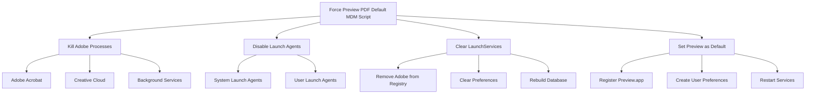

# Force Preview PDF Default - MDM Deployment Script

A robust macOS script for MDM deployment that forcefully sets Apple Preview as the default PDF handler, overriding Adobe Acrobat or Adobe Reader settings.

## Overview

This script addresses the common enterprise issue where Adobe Acrobat/Reader aggressively takes over as the default PDF handler, even after users or IT attempt to change it. The script uses multiple approaches to ensure Preview becomes and remains the default PDF application.

## Features

- **Aggressive Adobe Process Management**: Kills all Adobe processes and prevents them from re-registering
- **Launch Agent Control**: Disables Adobe launch agents that would restart services
- **LaunchServices Reset**: Completely rebuilds the file association database
- **Multi-User Support**: Applies changes for all user accounts on the system
- **MDM-Ready**: Designed to run as root via MDM platforms (Mosyle, Jamf, Kandji, etc.)
- **Detailed Logging**: Timestamped logs with clear status indicators
- **Graceful Error Handling**: Won't fail if Adobe isn't installed

## How It Works



## Script Actions

1. **Kill Adobe Processes**: Stops all running Adobe applications and services
2. **Disable Launch Agents**: Prevents Adobe services from restarting at login
3. **Unregister Adobe Apps**: Removes Adobe applications from LaunchServices
4. **Clear Preferences**: Removes all existing PDF file associations
5. **Restart Services**: Restarts preference daemons
6. **Rebuild Database**: Reconstructs the LaunchServices database
7. **Register Preview**: Explicitly registers Preview.app
8. **Set User Preferences**: Creates preference files for each user
9. **Optional: Clear File Attributes** (disabled by default for performance)
10. **Restart UI Services**: Restarts Finder and Dock for immediate effect

## Requirements

- macOS 10.14 or later
- Root/admin privileges (automatic when deployed via MDM)
- Apple Preview.app installed (standard on all macOS systems)

## Deployment

### Via Mosyle

1. Navigate to Management > Custom Commands
2. Create new Custom Command
3. Upload `force_preview_pdf_default_mdm.sh`
4. Set to run as root
5. Deploy to target devices

### Via Jamf

1. Go to Settings > Computer Management > Scripts
2. Upload the script
3. Create a policy to run the script
4. Scope to target computers

### Manual Execution

```bash
sudo ./force_preview_pdf_default_mdm.sh
```

## Performance Considerations

The script typically completes in 45-60 seconds. The longest operation is rebuilding the LaunchServices database (~30 seconds).

### Optional Step 9

Step 9 (clearing file-specific PDF associations) is commented out by default because:
- It's the slowest operation (can add several minutes)
- Scans all PDFs in Desktop, Documents, and Downloads
- Only needed if users have manually set individual PDFs to "Always Open With" Adobe
- The system-wide changes are usually sufficient

To enable if needed, uncomment the code in Step 9.

## Logging

The script provides detailed logging with timestamps and status indicators:
- ✓ Success
- ⚠ Warning (non-critical issue)
- ℹ Information (no action needed)

Example output:
```
[13:54:28] Step 1: Stopping Adobe processes...
[13:54:28]   ✓ Killed: Adobe Acrobat
[13:54:28]   ✓ Killed: AdobeResourceSynchronizer
```

## Troubleshooting

### PDFs Still Open in Adobe

1. Ensure the script ran successfully (check logs)
2. Have the user log out and back in
3. If issue persists, enable Step 9 to clear file-specific associations
4. Check if Adobe has been reinstalled

### Script Fails

- Verify running with root privileges
- Check if paths to applications are correct
- Ensure macOS version compatibility

### Adobe Keeps Coming Back

- Check for MDM policies that might be reinstalling Adobe
- Look for third-party software that depends on Adobe
- Consider scheduling the script to run periodically

## Why This Script Is Necessary

Adobe products use several mechanisms to maintain default handler status:
- Background processes that re-register periodically
- Launch agents that start at login
- Aggressive LaunchServices registration
- File-specific associations that override system defaults

This script addresses all these mechanisms comprehensively.

## Testing

1. Run the script
2. Double-click a PDF file
3. Verify it opens in Preview
4. Reboot and test again
5. Check after a few days to ensure persistence

## License

This script is provided as-is for enterprise use. Feel free to modify for your organization's needs.

## Support

For issues or questions:
- Check the detailed logs first
- Ensure Adobe isn't being reinstalled by other policies
- Test with Step 9 enabled if needed

---

**Keywords**: macOS, PDF, Preview, Adobe, Acrobat, MDM, Mosyle, Jamf, LaunchServices, enterprise, deployment 